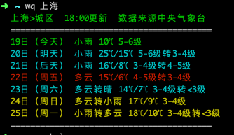

# wq

Weather Query Command line tool in China.查询国内天气情况的终端工具。

## 特性

* 实时从中央气象台获取数据。
* 简单易用。
* 丰富多彩的输出结果。

## 安装

```shell
npm install wq-cli -g
```

## 使用

```shell
wq <city>
```

示例：
```shell
wq 上海
```

结果：


## 声明

仅限学习交流，不得用于其他任何用途。

## 协议

MIT
